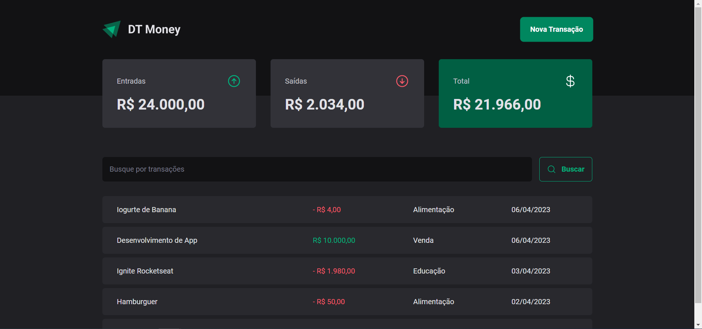
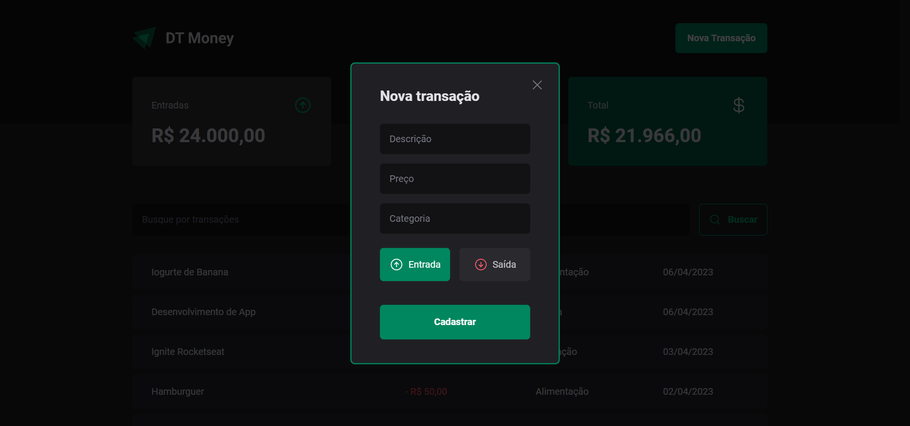
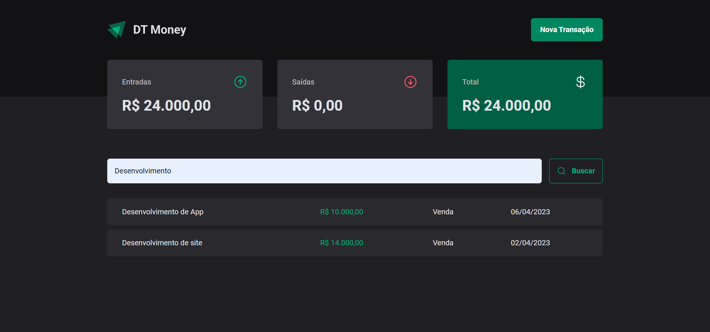

<h1 align="center">
  
</h1>

<h3 align="center">
  Projeto 03: Dt Money
</h3>

<blockquote align="center">“O planejamento financeiro é a chave para alcançar seus objetivos e realizar seus sonhos.”</blockquote>

<p align="center">
  

  <a href="https://github.com/alleycarvalho/dt-money/stargazers">
    
  </a>
</p>

## :rocket: Sobre o projeto

- Uma aplicação para controle financeiro, com cadastro de entradas e saídas, permitindo filtros de resultados.

---

## :computer: Testar a aplicação

```shell
# Clona o projeto:
git clone https://github.com/alleycarvalho/dt-money.git

# Acessa o diretório do projeto:
cd dt-money

# Instala dependências:
yarn install

# Executa o servidor que simula uma Api REST (json-server):
yarn dev:server

# Executa a aplicação:
yarn dev

```

### Acessar o endereço gerado no navegador:
http://localhost:5173/

---

## :mortar_board: Ignite - Projeto 03

### Ferramentas, tecnologias e conceitos utilizados:

- [React](https://react.dev) - Projeto iniciado com [Vite](https://vitejs.dev)
- [Typescript](https://www.typescriptlang.org)
- [EditorConfig](https://editorconfig.org) e [ESLint](https://eslint.org)
- [Styled Components](https://styled-components.com) - Biblioteca para estilização de componentes
- [Phosphor Icons](https://phosphoricons.com)
- [React Hook Form](https://react-hook-form.com)
- [Zod](https://zod.dev) - Biblioteca para validação de campos em formulários
- [Radix UI](https://www.radix-ui.com) - Biblioteca para componentes acessíveis e sem estilização
- [Json Server](https://github.com/typicode/json-server) - Biblioteca para simular uma Api REST
- [Axios](https://axios-http.com/ptbr) - Cliente HTTP baseado em promessas

### Funcionalidades:

- Adicionar um novo projeto com tempo determinado;
- Iniciar contagem regressiva no tempo do projeto;
- Interromper projeto;
- Visualizar histórico de projetos;

---

## :computer: Resultado do projeto

### Página inicial do projeto:



### Página com formulário para adicionar entradas e saídas:



### Página com resultados filtrados:



---

Projeto realizado por <strong>Alley M. Carvalho</strong>

[Rocketseat](https://www.rocketseat.com.br): Ignite - ReactJS - Projeto 03: Dt Money
